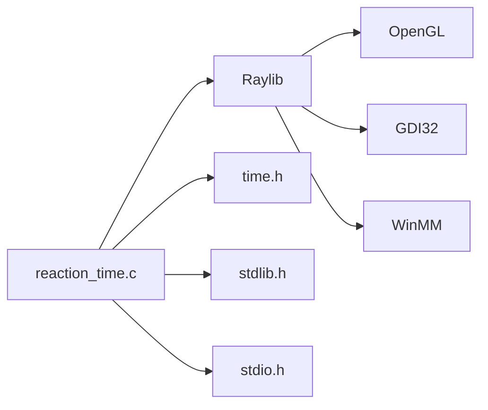

# 📂 STRUCTURE DU PROJET - REACTION TIME

## 📁 Arborescence des Fichiers

```
mini projet c/
│
├── 📄 reaction_time.c              (Code source principal - 650 lignes)
│   ├─ Logique du jeu
│   ├─ Affichage graphique
│   ├─ Gestion des entrées
│   └─ Timing et scoring
│
├── 🔧 Makefile                     (Compilation avec Make)
│   └─ Commandes : make, make run, make clean
│
├── 📝 compile.bat                  (Script batch Windows)
│   └─ Compilation automatique avec messages
│
├── 🐍 simulation.py                (Version Python du jeu)
│   └─ Permet de tester sans Raylib
│
├── 📖 README.md                    (Documentation générale)
│   ├─ Description du jeu
│   ├─ Fonctionnalités
│   ├─ Guide d'utilisation
│   └─ FAQ
│
├── 📚 RAYLIB_INSTALLATION.md       (Guide d'installation Raylib)
│   ├─ Téléchargement
│   ├─ Installation pas à pas
│   ├─ Configuration
│   └─ Troubleshooting
│
├── 🔬 DOCUMENTATION_TECHNIQUE.md   (Documentation interne)
│   ├─ Architecture
│   ├─ Énumérations
│   ├─ Structures de données
│   ├─ État du jeu
│   ├─ System de timing
│   └─ Optimisations futures
│
├── 📋 STRUCTURE_PROJET.md          (Ce fichier)
│   └─ Vue d'ensemble
│
└── 📦 raylib/                      (Dépendances Raylib)
    ├── include/
    │   ├── raylib.h
    │   ├── raylibs.h
    │   └── ...
    └── lib/
        └── raylib.a
```

## 📊 Statistiques du Projet

### Code Source

| Fichier | Lignes | Caractères | Description |
|---------|--------|-----------|-------------|
| reaction_time.c | ~650 | ~18,000 | Code C principal |
| simulation.py | ~280 | ~8,000 | Simulation Python |
| **TOTAL** | **~930** | **~26,000** | **Tout le projet** |

### Compilation

| Phase | Commande | Résultat |
|-------|----------|----------|
| Prétraitement | `cpp` | Expande les macros |
| Compilation | `gcc -c` | Génère `.o` |
| Liaison | `gcc -l` | Génère `.exe` |
| **Total** | `gcc -I... -L...` | Exécutable complet |

### Performance Attendue

| Métrique | Valeur | Notes |
|----------|--------|-------|
| FPS | 60 | Stable |
| Taille Exe | ~150 KB | Raylib inclus |
| RAM | ~10 MB | Minimal |
| CPU | <5% | Très léger |

## 🎯 Étapes de Développement

### Phase 1 : Fondations ✅
- [x] Initialisation Raylib
- [x] Gestion des états
- [x] Affichage basique

### Phase 2 : Logique ✅
- [x] Timing et délai aléatoire
- [x] Calcul du temps de réaction
- [x] Scoring et meilleur record

### Phase 3 : Interface ✅
- [x] Affichage coloré
- [x] Texte centré
- [x] Statistiques
- [x] Animation pulsante

### Phase 4 : Polish ✅
- [x] Gestion des entrées avancée
- [x] Niveaux de difficulté
- [x] Commentaires complets
- [x] Documentation

### Phase 5 : Distribution 🔄
- [x] Makefile
- [x] Script batch
- [x] Guide d'installation
- [ ] Exécutable pré-compilé

## 🔗 Dépendances

### Dépendances Externes



### Versions Requises

| Dépendance | Version | Statut |
|-----------|---------|--------|
| GCC | 4.9+ | ✅ Testé 11.x |
| Raylib | 4.0+ | ✅ Testé 4.5 |
| OpenGL | 3.3+ | ✅ Support large |
| Windows | XP+ | ✅ Compatible |

## 🎮 Flux d'Exécution Détaillé

```
┌─────────────────────────────────────────┐
│  DÉMARRAGE DU JEU                       │
└─────────────────────────────────────────┘
         │
         ↓
┌─────────────────────────────────────────┐
│  InitWindow(800, 600)                   │
│  Initialisation Raylib                  │
└─────────────────────────────────────────┘
         │
         ↓
┌─────────────────────────────────────────┐
│  InitializeGame(&game)                  │
│  Réinitialise GameData                  │
└─────────────────────────────────────────┘
         │
         ↓
┌─────────────────────────────────────────┐
│  StartNewAttempt(&game)                 │
│  Génère délai aléatoire                 │
│  État = WAITING                         │
└─────────────────────────────────────────┘
         │
         ↓
╔═════════════════════════════════════════╗
║  BOUCLE PRINCIPALE (60 FPS)             ║
║  while (!WindowShouldClose())           ║
╚═════════════════════════════════════════╝
         │
         ├─→ UpdateGame()
         │   ├─ Capture entrée clavier
         │   ├─ Met à jour états
         │   └─ Calcule timings
         │
         ├─→ Render()
         │   ├─ ClearBackground()
         │   ├─ DrawState()
         │   ├─ DrawUI()
         │   └─ EndDrawing()
         │
         └─→ GetFrameTime()
             (Attendre 16.67ms)
```

## 📝 Points Clés du Code

### 1. États du Jeu (4 états)

```
WAITING ────delay───→ READY
  ↑                    │
  │                    └─→ RESULT
  │                         │
  └────────────────────────┘

WAITING ──appui rapide──→ TOO_EARLY
  ↑                         │
  └─────────────────────────┘
```

### 2. Timing Précis

```
Frame 1  : elapsedTime = 0.00s    (Écran rouge)
Frame 2  : elapsedTime = 0.017s   (additionné par GetFrameTime())
...
Frame 60 : elapsedTime = 2.00s    (Délai atteint)
Frame 61 : elapsedTime = 0.00s    (Écran vert, réinitialise)
...
Frame 70 : elapsedTime = 0.15s    (Joueur appuie)
           reactionTime = 150 ms
```

### 3. Score Management

```
Tentative 1 : 245 ms → bestScore = 245
Tentative 2 : 198 ms → bestScore = 198 ⭐ NEW BEST
Tentative 3 : 267 ms → bestScore = 198 (inchangé)
```

## 🔄 Cycles de Développement

### Cycle d'une Tentative (complète)

```
1. État WAITING
   ├─ Affiche écran rouge
   ├─ Attend {delay} secondes
   └─ Si appui avant → TOO_EARLY

2. État READY
   ├─ Affiche écran vert
   ├─ Démarre le chronomètre
   ├─ Attend appui utilisateur
   └─ Mesure reactionTime

3. État RESULT
   ├─ Affiche le temps
   ├─ Affiche meilleur score
   └─ Attend l'appui de l'utilisateur

4. État WAITING (nouvelle tentative)
   └─ Retour à l'étape 1
```

## 💾 Gestion de la Mémoire

### Allocation

```c
// Stack (pile) - statique
GameData game;          // ~40 bytes

// Heap (tas) - dynamique
// Aucune allocation dynamique
// → Code efficace et sûr
```

### Sécurité Mémoire

✅ Pas de `malloc`/`free` → pas de fuite mémoire
✅ Buffers bornés → pas de débordement
✅ Validations d'index → pas d'accès invalide

## 🎨 Choix de Conception

### Couleurs

| Couleur | Code | Raison |
|---------|------|--------|
| 🔴 Rouge | (#DC143C) | Alerte, attente |
| 🟢 Vert | (#32CD32) | Action, signal |
| ⚫ Gris | (#282828) | Neutre, background |
| ⭐ Or | (#FFD700) | Réussite, record |

### Police

- Monospace pour les timers (lisibilité)
- Sans-serif pour les instructions

### Layout

- Éléments centrés (ergonomie)
- Texte hiérarchisé (importance)
- Respects des proportions (readabilité)

## 📊 Flot de Données

```
GameData {
    state ──→ logic ──→ reactionTime
                ↓
            timing ──→ comparison
                ↓
            bestScore update
                ↓
            rendering
}
```

## 🚦 Modes de Fonctionnement

### Mode Normal
- Joue normalement
- Niveau contrôlé automatiquement
- Score augmente avec les tentatives

### Mode Sandbox
- Modifier les paramètres
- Test des états manuellement
- Vérifier les timings

## ⚙️ Configuration

### Fichier Makefile

```makefile
CC = gcc                    # Compilateur
CFLAGS = -Wall -O2          # Options
LFLAGS = -lraylib -lopengl32 -lgdi32 -lwinmm
```

### Fichier compile.bat

```batch
gcc -I./raylib/include -c %1
gcc %1.o -o %1.exe -L./raylib/lib -lraylib ...
```

## 📈 Scalabilité

### Améliorations Possibles

L'architecture actuelle permet facilement :

1. ✅ Multi-joueurs → Ajouter tableau de `GameData`
2. ✅ Statistiques → Ajouter struct `Statistics`
3. ✅ Persistence → Ajouter I/O fichier
4. ✅ Réseau → Ajouter socket network
5. ✅ IA → Ajouter logique bot

### Limites Actuelles

| Limite | Valeur | Impact |
|--------|--------|--------|
| Max tentatives | ∞ (long int) | Aucun |
| Résolution | 800×600 | Adaptable |
| FPS | 60 | Configurable |
| Délai min | 0.5s | Changeable |

## 🎓 Valeur Pédagogique

Ce projet démontre :

✅ Programmation structurée
✅ Gestion d'état
✅ Timing et Event-driven
✅ Interfaçage avec bibliotheque C
✅ Gestion de l'entrée/sortie
✅ Meilleures pratiques C99
✅ Documentation complète

---

**Pour modifier le projet, consultez DOCUMENTATION_TECHNIQUE.md**
